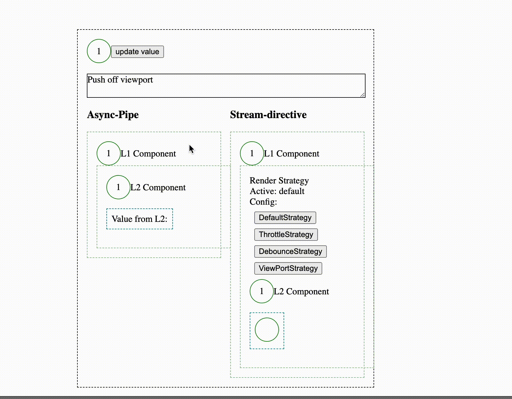
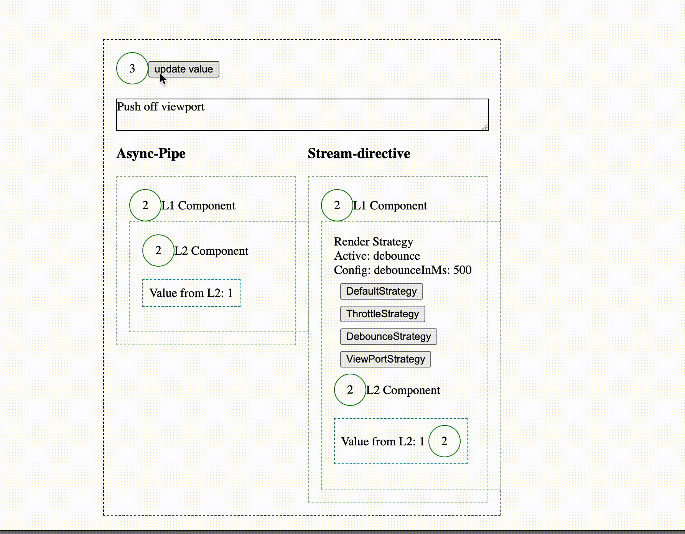

# @angular-kit/stream

- ✅ Optimized change detection in comparison to `async` pipe
- ✅ Lazy by default
- ✅ Render strategies to further push change detection optimization
- ✅ Loading, error and complete state
- ✅ Easy template customization via ng-templates or components for e.g. spinners
- ✅ no third-party dependencies

# Installation

```bash
npm install @angular-kit/stream
```

## Usage

### Basic example

❌ Instead of doing this
```html
<ng-container *ngIf="source | async as value">
  {{ value  }}
</ng-container>
```

✅ Do this:

```html
<ng-container
  *stream="
    source$;
    let value;
  "
>
  {{ value }}
</ng-container>

```

```typescript
@Component({})
export class MyComponent {
  source$ = this.http.get('https://jsonplaceholder.typicode.com/posts/1');
}
```

### Advanced example

```html
<ng-container
  *stream="
    source$;
    let value;
    let error = error;
    let complete = completed;
    let loading = loading;
    loadingTemplate: loadingTemplate;
    errorTemplate: errorTemplate;
    completeTemplate: completeTemplate;
    keepValueOnLoading: true;
    renderStrategy: {type: 'throttle', throttleInMs: 250}
  "
>
  {{ value }}
</ng-container>

<ng-template #loadingTemplate let-loading="loading">
  <my-spinner [loading]="loading"></my-spinner>
</ng-template>
<ng-template #errorTemplate let-error="error"> error context: {{ error }} </ng-template>
<ng-template #completeTemplate let-completed="completed"> completed context: {{ completed }} </ng-template>
```

```typescript
@Component({})
export class MyComponent {
  source$ = this.http.get('https://jsonplaceholder.typicode.com/posts/1');
}
```

### using `renderCallback`

```html
<ng-container
  *stream="
    source$;
    renderCallback: renderCallback$$
  "
>
  {{ value }}
</ng-container>

```

```typescript
@Component({})
export class MyComponent {
  source$ = this.http.get('https://jsonplaceholder.typicode.com/posts/1');
  renderCallback$$ = new ReplaySubject<RenderContext>(1)
}
```

### API

#### Inputs

- `source$` - Observable that will be subscribed to
- `keepValueOnLoading` - If `true` the last value will be kept on loading state. If `false` the last value will be cleared on loading state. Default value is `false`.
- `refreshSignal` - Subject that will be used to trigger refresh.
- `loadingTemplate` - Template that will be used to render loading state.
- `errorTemplate` - Template that will be used to render error state.
- `completeTemplate` - Template that will be used to render complete state.
- `lazyViewCreation` - If `true` the view will be created only when the observable emits. If `false` the view will be created on init. Default value is `true`.
- `renderCallback` - can be configured by passing a `Subject` and this will emit everytime a `RenderContext`-value whenever a rendering happens. `RenderContext` contains the `value`, `error` and the render context. The render context does contain a information when the re-rendering has happened: `before-next`: before the next value arrives; `next`: when the next value has arrived; `error`: when an error occoured.
- `renderStrategy` - a configuration to further push change detection. See `render strategy` section below

#### Context variables

- `$implicit` - Last value emitted by `source$`
- `error` - Error emitted by `source$`
- `completed` - `true` if `source$` completed
- `loading` - `true` if `source$` is loading

### Configuration

You can configure `stream` to use defined components for loading, error and complete states instead of passing templates.

```typescript
@NgModule({
  providers: [
    provideStreamDirectiveConfig({
      loadingComponent: MyLoadingComponent,
      errorComponent: MyErrorComponent,
      completeComponent: MyCompleteComponent,
    }),
  ],
})
export class AppModule {}
```

In your custom components you have access to the context via `STREAM_DIR_CONTEXT` injection token.

```typescript
@Component({
  selector: 'my-loading',
  template: ` <div *ngIf="loading">Loading... {{ context.loading }}</div> `,
})
export class MyLoadingComponent {
  context = injectStreamDirectiveContext();
  
}
```

_Note_ When using components and passing templates, the templates will be used instead.

#### `StreamDirectiveConfig` options

- `loadingComponent` - Component that will be used to render loading state.
- `errorComponent` - Component that will be used to render error state.
- `completeComponent` - Component that will be used to render complete state.
- `keepValueOnLoading` - config to define if the current rendered value should be kept when the value source is in a loading state or not. Default is false.
- `lazyViewCreation` - config to define if the view should be created only when the value source emits a value. Default is `true`.
- `renderStrategy` - a configuration to further push change detection. See `render strategy` section below.

### Render strategies
A `RenderStrategy` can be used to minimize change detection cycles. There are four strategies supported:
* `DefaultRenderStrategy` - the default strategy ( a local change detection strategy).
* `ThrottleRenderStrategy` - a strategy which throttles the change detections by a defined time interval.
* `DebounceRenderStrategy` - strategy which debounces the change detection cycles by a given time interval.
* `ViewPortRenderStrategy` - this strategy does only trigger change detection when an element is visible within the viewport. If the element is visible within the viewport, the element uses the `DefaultRenderStrategy` as long as it is visible.


> **Warning**
> The `RenderStrategy` can be switched on runtime. However there is currently some unexpected behaivor: When using `ThrottleRenderStrategy` or `DebounceRenderStrategy` and then switching to `ViewPortRenderStrategy`, the strategies are accumulated. Means the change detections are throttled/debounced and only detected when visible within the viewport. Only a switch to `DefaultRenderStrategy` in between does result in a correct behaivor. This is a bug and will be fixed in a future version!

#### `DefaultRenderStrategy`


##### Configuration
No Options available.

### `ThrottleRenderStrategy`


##### Configuration
* `throttleInMs` - the time interval in milliseconds to throttle the change detection cycles.
### `DebounceRenderStrategy`


##### Configuration
* `debounceInMs` - the time interval in milliseconds to debounce the change detection cycles.
### `ViewPortRenderStrategy`


##### Configuration
This strategy is based on the `IntersectionObserver` API. If the browser does not support this API the strategy falls back to `DefaultRenderStrategy`.

- `rootMargin`: root margin in px, see [MDN](https://developer.mozilla.org/en-US/docs/Web/API/IntersectionObserver/IntersectionObserver)
- `threshold`: threshold, see [MDN](https://developer.mozilla.org/en-US/docs/Web/API/IntersectionObserver/IntersectionObserver)
- `root`:  root element, see [MDN](https://developer.mozilla.org/en-US/docs/Web/API/IntersectionObserver/IntersectionObserver)

## Comparison of `async`-pipe vs `*stream`-directive

If we compare a highly optimized application where all components are using `OnPush` change detection strategy we can observe that the
usage of the `async`-pipe is still quite expensive at it is internally calling `markForCheck` which marks the component itself and all of its parents for change detection.
So the whole component (sub)-tree gets re-rendered. So not only the complete template of the affected component gets re-rendered but also its parents.

`*stream` on the other hand will only update the affected tiny template-piece:


### Comparison of dirty checks: `async`-pipe vs `*stream`-directive
The numbers in the green circels cound the render-cycles. Please not on the right side where only the tiny template
piece within `L2 Component` gets updated (the number on the left besides this name does not increase).

Whereas on the left side all values do increase. There's no counter in the tiny template piece on the left because the
`async`-pipe does trigger change detection on the whole component - therefore we only have a counter on component level.


## Versioning
* [Semantic Versioning 2.0.0](http://semver.org/)
* Version 1.x.x is compatible with Angular 11.x.x
* Version 2.x.x is compatible with Angular > 14.x.x
